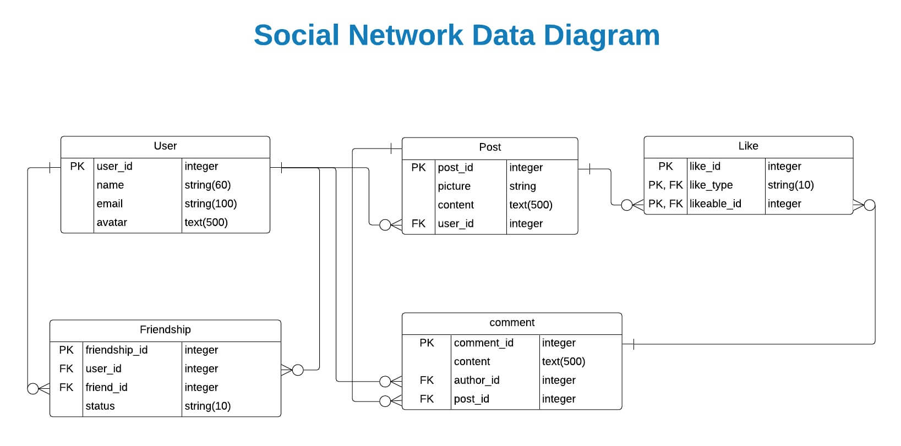

<h1 align="center">Welcome to Social Network 👋</h1>
<p align="center">
  
  <a href="https://github.com/kelvin8773/social-net" target="_blank">
    
  </a>
  <a href="https://github.com/kelvin8773/social-net/blob/master/LICENSE" target="_blank">
    
  </a>
  <a href="https://twitter.com/kelvin9877" target="_blank">
    
  </a>
</p>

[](https://social-net-8873.herokuapp.com/)

> A social media app designed to mimic Facebook's core features, such as the ability to create and manage posts, send friend requests, and upload images. I built this project to learn advanced concepts in Rails.

### ✨ [Demo](https://social-net-8873.herokuapp.com/)

### Main Feature
* User Sign Up with email
* User Sign in with Facebook ID/Email address
* Post Text and Picture
* Like or Comment a Post
* Request to friend other users
* Accept / Refuse friend request
* Update detail personal info
* Update password



### Features to implement
* Improve UI Design
* System Notification (including Friend Request, Like or Comment your post, @you)
* Support picture upload
* Support Rich Text editing
* Support more social accounts login (such github, google, twitter)

## Install

```sh
bundle install
```

## Usage

```sh
rails server
```

## Author

👤 **Kelvin Liang**

* Website: https://medium.com/@Kelvin9877
* Twitter: [@kelvin9877](https://twitter.com/kelvin9877)
* Github: [@kelvin8773](https://github.com/kelvin8773)
* LinkedIn: [@kelvin9877](https://linkedin.com/in/kelvin9877)
* Email: [kelvinliang@yandex.com](mailto:kelvinliang@yandex.com)

**I am available for hire/looking for next dev position.**

## 🤝 Contributing

Contributions, issues and feature requests are welcome!<br />Feel free to check [issues page](https://github.com/kelvin8773/social-net/issues). You can also take a look at the [contributing guide](https://github.com/kelvin8773/social-net/pulls).

## Show your support

Give a ⭐️ if this project helped you!

## 📝 License

Copyright © 2020 [Kelvin Liang](https://github.com/kelvin8773).<br />
This project is [MIT](https://github.com/kelvin8773/social-net/blob/master/LICENSE) licensed.

***
_This README was generated with ❤️ by [readme-md-generator](https://github.com/kefranabg/readme-md-generator)_